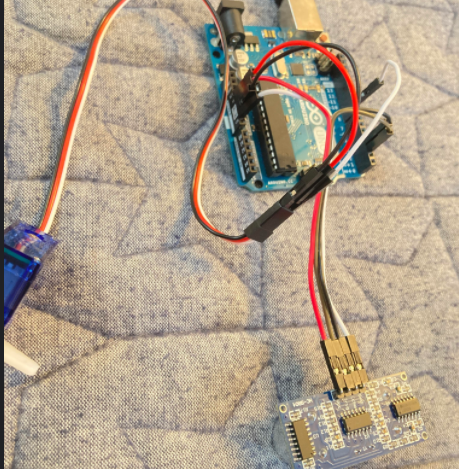
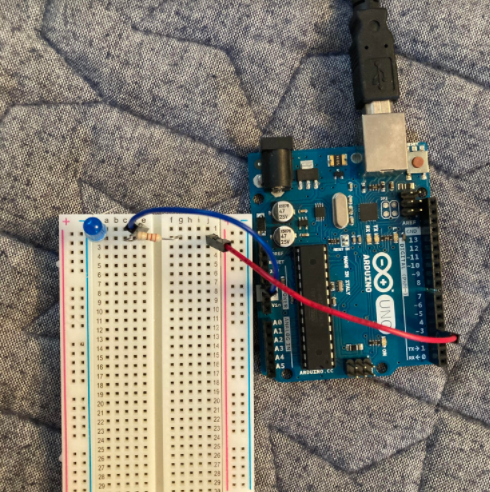

# Arduino

---

## Finite LED Blinker

For this assignment I added to my earlier LED blinking program by making it blink only 5 times, and display how many times it blinked. After this assignment I feel that I understand if statements and variables pretty well. I also am more comfortable with printing to the monitor and making an LED blink now that I've has more practice.

### Wiring

[Link to Code](https://create.arduino.cc/editor/jconkli07/8e330e15-7bb3-4027-ba97-ca31b3a4a79e/preview)

---

## LED Blink Revisited

For this assignment I made an LED fade in and out forever and displayed a line of x's that showed how bright the LED was. There were more x's when the LED was bright and fewer when it was dark. This assignment was relatively easy, but I had a problem because I was plugging my a wire into the wrong pin, but I figured it out and fixed it. This helped me with learning the wiring, after this assignment I feel like I understand it a lot better.

### Wiring

[Link to Code](https://create.arduino.cc/editor/jconkli07/cfdf81ed-eb31-4a88-9bb6-84eef9101d40/preview)

---

## Hello Functions

For this assignment I used the servo and ultrasonic sensor for the first time. I made the sevo turn at different speeds depending on how far an object was from the sensor. Google was really helpful with this assignment, it helped me with the wiring and how to get the distance from an ultrasonic sensor. I feel that I understand functions pretty well after this asignment, and I also feel relatively confident with using the ultrasonic sensor and servo, whereas before I had little to no experience.

### Wiring

[Link to Code](https://create.arduino.cc/editor/jconkli07/2b9b169b-8c60-455b-9398-b49226155327/preview)

---
